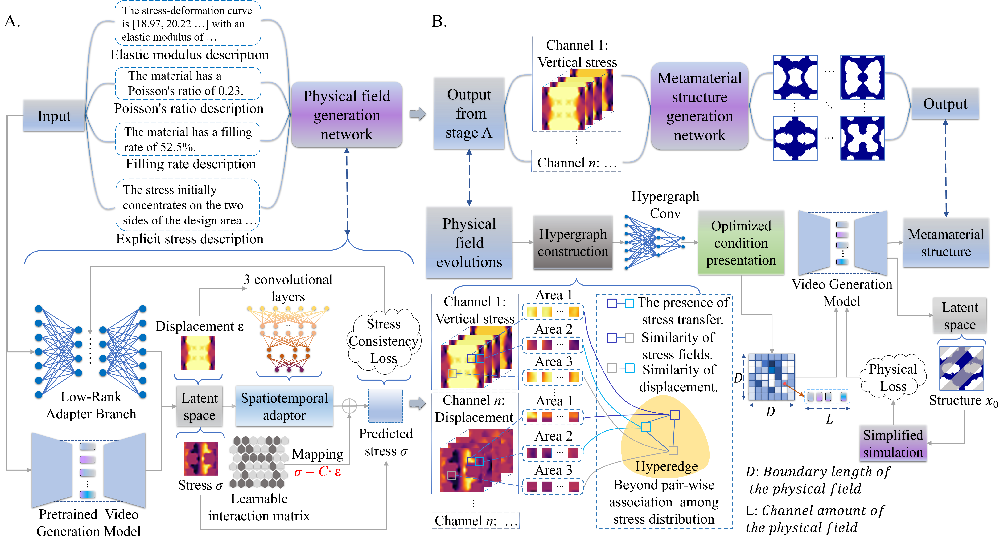
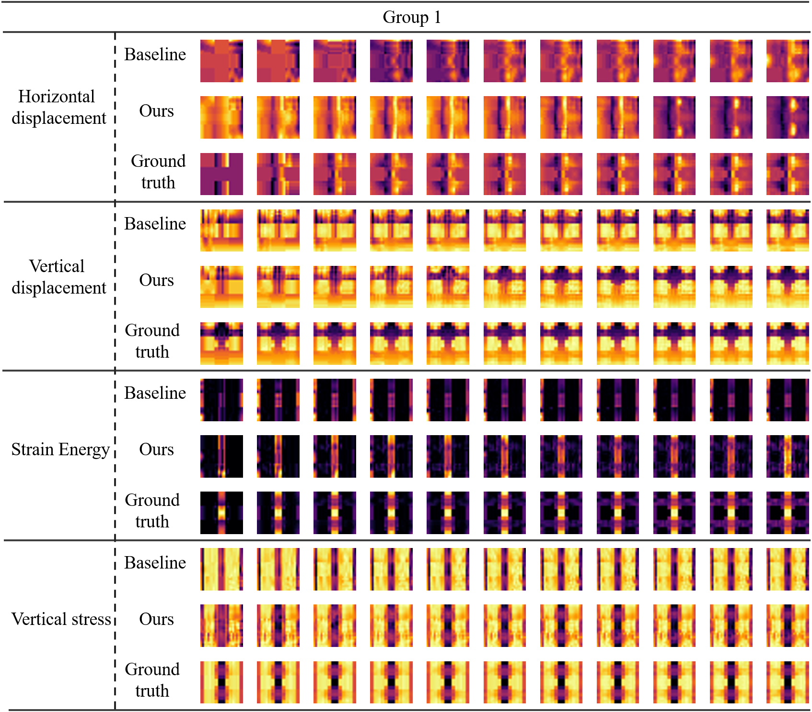
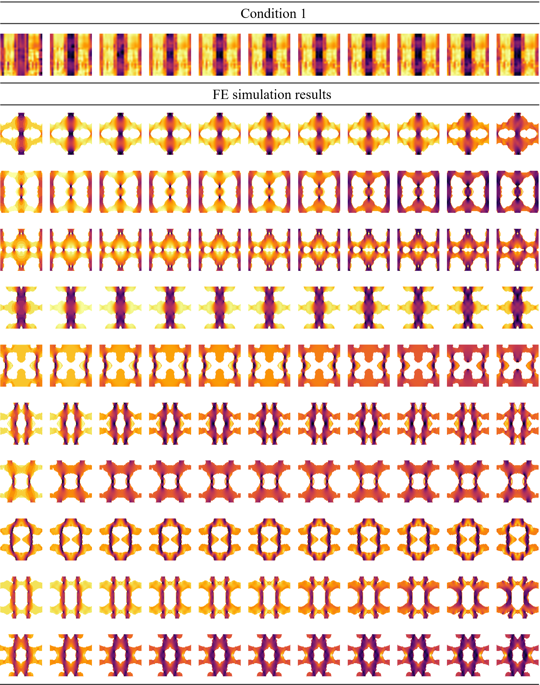

# HyperDiffusion-Meta: Physics-Aware Metamaterial Generation via Hypergraph Neural Operators and PDE-Constrained Diffusion

<strong>HyperDiffusion-Meta: Physics-Aware Metamaterial Generation via Hypergraph Neural Operators and PDE-Constrained Diffusion</strong>
     
    <a href='' target='_blank'>Shiyang Li</a>&emsp;
    <a href='' target='_blank'>Changqing Zou</a>&emsp;
    <a href='' target='_blank'>Yuan Feng</a>&emsp;
    <a href='' target='_blank'>Zeyu Ling</a>&emsp;
    <a href='' target='_blank'>Yue Gao*</a>&emsp;
     
    Zhejiang University&emsp;
    Zhejiang Lab&emsp;
    Tsinghua University
     
 

## Introduction

To address the limitations of data-driven approaches in physical generalization, we propose **HyperDiffusion-Meta**, a novel cascade generation framework that integrates **PDE equation-constrained physical field generation** with **hypergraph-enhanced metamaterial structure generation**. This architecture aligns with the physical principles of field-structure coupling, bridging the semantic gap between text descriptions and high-precision metamaterial design.

## Core Capabilities

### Physical Field Generation

- Generate `24×24` resolution, **11-frame spatiotemporal evolution videos** of physical fields (stress, displacement, energy) from text descriptions
- PDE constraints ensure alignment with physical derivation principles
- Support training of core models and LoRA models

### Metamaterial Structure Generation

- Convert physical field dynamics into `96×96` resolution, **11-frame structural designs**
- Hypergraph-enhanced multi-body interaction modeling

- Support training of **core models**

## Experimental Validation

### Physical Field Evolution Visualization

**Caption 1**: 11-frame physical field evolution.  
The corresponding text description is: "The stress-deformation curve is [ 2.8416464   5.56532793  8.90970995 11.95134577 14.52898791 16.64173034 18.3723464  19.82253748 21.08224386 22.20824084 23.23202267 24.17922589 25.06275079 25.88798404 26.66048822 27.38622209 28.07322818 28.72893706 29.35358101 29.94760704 30.51582116 31.06049943 31.58202618 32.07869253 32.54555932 32.98015028 33.38244087 33.75107026 34.11881983 34.52373421 34.89770281 35.27275842 35.60765815 35.90057755 36.24841392 36.69117623 37.18285537 37.78737015 38.31521547 38.77203637 39.19739723 39.54972541 39.88383061 40.27118659 40.57959014 40.82098454 41.04348421 41.16358298 41.22151887 41.0586614 ], with an elastic modulus of 150.69 MPa. The material has a Poisson's ratio of 0.14.  The material has a filling rate of 50.56\%. The stress initially concentrates on the two sides of the design area and then transfers to the middle of the design area."

### FEM-Verified Metamaterial Design

**Caption 2**: FEM simulation results of designs.  

*(For detailed implementation and simulation results, refer to the Supplementary Materials.)*

---

**Explore our codebase to experience how HyperDiffusion-Meta bridges AI-driven design with physics-first principles!** 🚀

